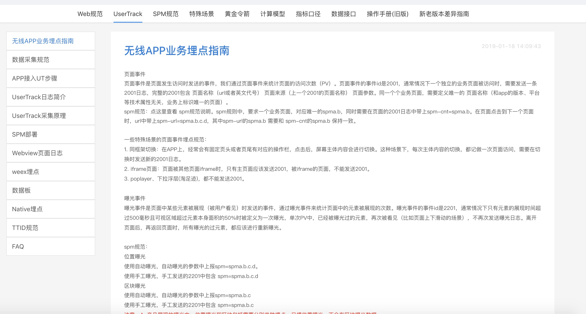
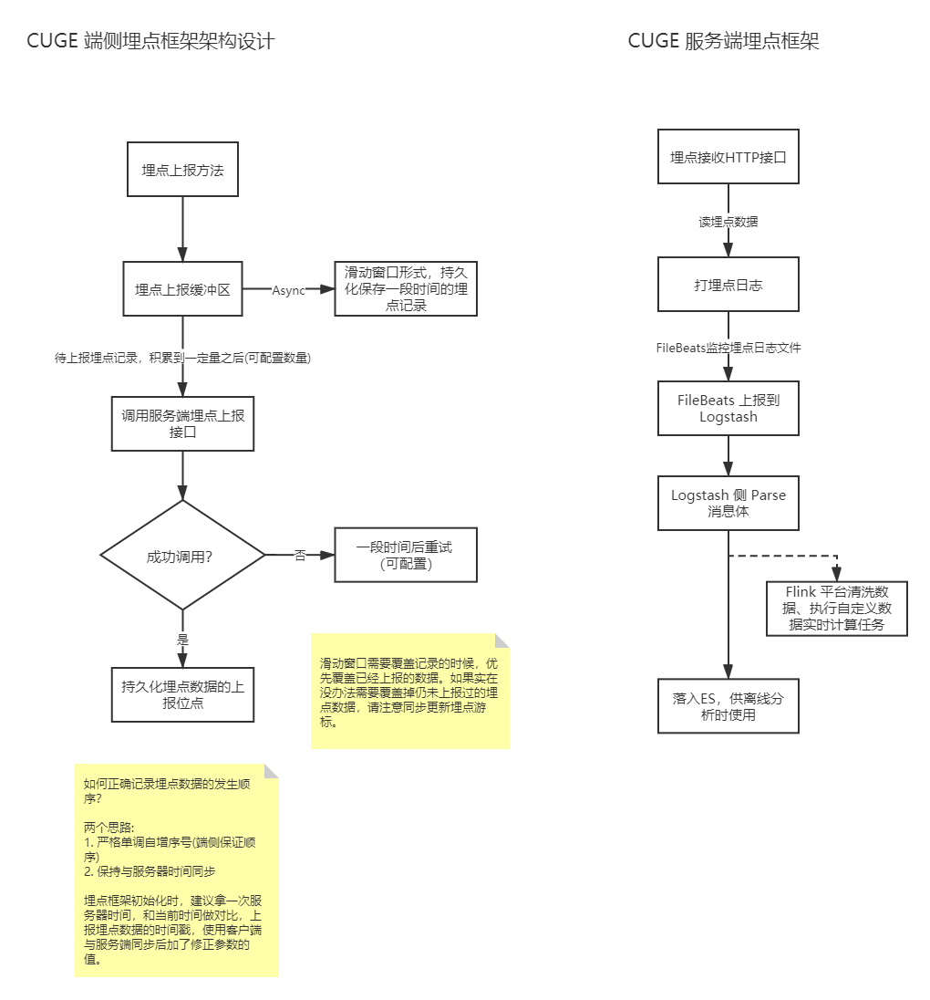

# 埋点系统设计

## 为什么需要埋点系统

产品的开发者们最关心的事情莫过于用户是如何使用他们的产品的，用户会在他们的产品上干什么。

只有知道现阶段产品用户群的习性，才能帮助开发者们更好的回答以下几个问题：1. 用户最喜欢这个产品的什么功能？2. 用户最不喜欢这个产品的什么功能？3. 这个产品什么功能最受欢迎？什么功能又鲜有人问津？4. 推出了某个新功能，他的受众怎么样，有没有人用？用户是否愿意在这个新功能上花时间？

同时，用户行为数据，也能为后续迭代产品功能，规划产品的发展方向提供有力依据。而为了准确的获取用户使用产品的行为数据，一个有力的工具就是埋点系统。

一个好的埋点系统，应该能够精准的反应**用户**操作的动作。例如点击跳转(src, dst)动作，返回动作，停留动作（页面、数据曝光），同时埋点数据要能支持方便的解析，过滤，入库（特别是关系型数据库，Hive，ELK之类的），分类（埋点有不同的分类维度），扩展（埋点可带扩展字段）等能力。

我们在CUGE 平台及CUGE SDK中内嵌这样的一套相对完整，成熟的埋点系统，目的就是让中小型企业在产品的初期就能获得上文提到的360°洞察产品开发成效的能力，助力企业及产品的快速发展。

## 埋点曝光规则



**tp参数语义**

tp参数有三种形式，tp.a.b.c.d，tp.a.b.c，tp.a.b。下表描述了三种形式的tp参数的适用场景:

| 参数形式   | 参数语义                                                     | 参数适用场景                                                 |
| ---------- | ------------------------------------------------------------ | ------------------------------------------------------------ |
| tp.a.b.c.d | a: 事件发生页面<br />b. 事件发生控件<br />c. 事件到达页面<br />d. 事件参数(Base64安全编码) | 页面跳转事件，控件点击事件，位置(可跳转)曝光事件。           |
| tp.a.b.c   | a. 事件发生页面<br />b. 事件发生控件<br />c. 事件参数(Base64安全编码) | 区块曝光事件（例如不可点击的banner位曝光，popup曝光）        |
| tp.a.b     | a. 事件到达页面<br />b. 事件参数                             | 页面到达事件（发生了来源不明的跳转后使用，原则是能发跳转尽量发跳转，发不出跳转才发到达。） |

**页面事件**

| 事件ID | 事件类型     | 事件参数   | 事件触发时机                                                 |
| ------ | ------------ | ---------- | ------------------------------------------------------------ |
| 1001   | 控件点击事件 | tp.a.b.c.d | 控件执行onClick时发出，如果控件没有onClick方法，则在`MotionEvent.ACTION_UP`的时候发出。 |
| 1002   | 页面跳转事件 | tp.a.b.c.d | 跳转到达落地页时发出。                                       |
| 1003   | 页面到达事件 | tp.a.b     | 来源不明时跳转到落地页时发出。                               |

**曝光事件**

| 事件ID | 事件类型 | 事件参数   | 事件触发时机 |
| ------ | -------- | ---------- | ------------ |
| 2001   | 位置曝光 | tp.a.b.c.d | 参照上图要求 |
| 2002   | 区块曝光 | tp.a.b.c   | 参照上图要求 |

## 框架结构设计



## 日志格式设计

埋点使用以下形式的文本，发送到服务器的特定接口上。

```
|timestamp（精确到ms)|###|order(0开始，用于解决1ms内发生多个事件的先后顺序)|###|deviceId|###|userId(游客给-1)|###|bizline|###|appid|###|frameworkversion|###|埋点事件ID|###|tp.a.b.c.d(埋点参数)|###|extdata（埋点携带的额外数据）|
```

其中`|###|`是分隔符，为了保证尽可能正确的分割。