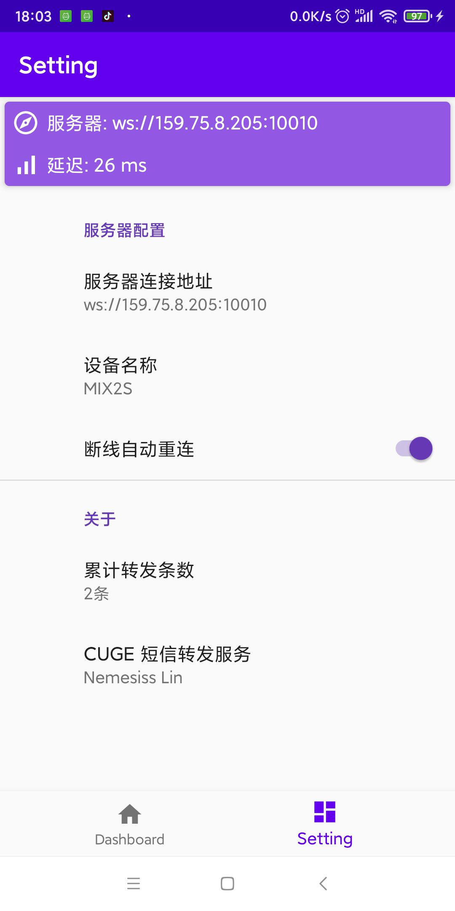
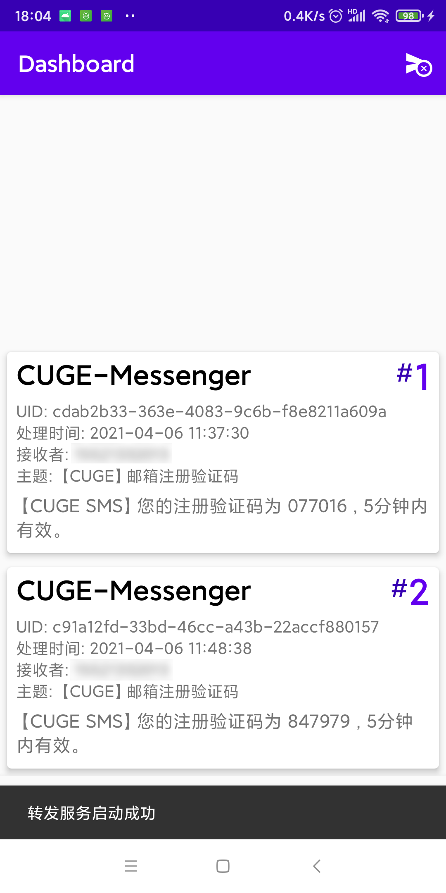
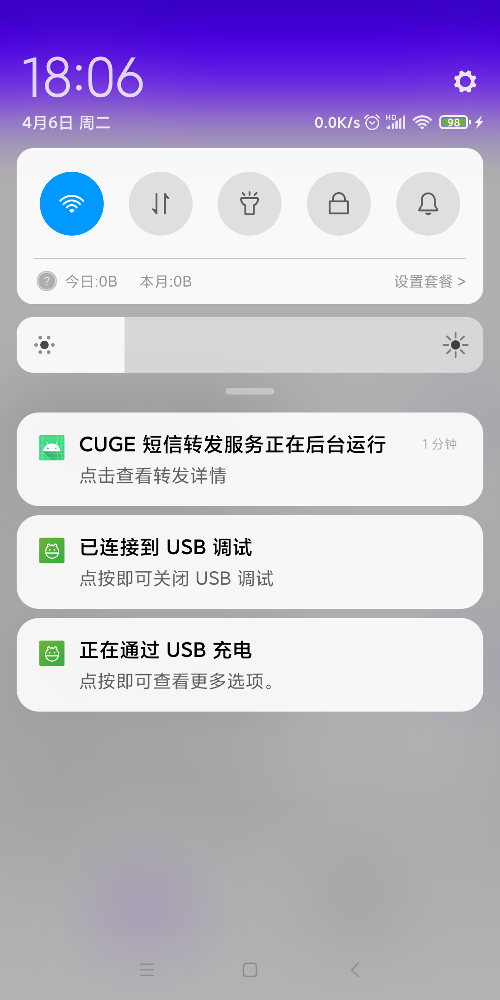

# 短信转发服务

当业务方出于某些原因，暂时没能申请到公共的短信发送服务时，CUGE实现了一个基于Android平台的短信转发工具。最低只需要一台能收发短信，能联网的Android设备，即可打通所有需要短信下发的场景。

[下载地址](https://nemesiss-1255798866.cos.ap-guangzhou.myqcloud.com/CUGE/MessengerRelayer.apk)

使用方式

* 设置服务器连接地址 (一般来说只要改IP和端口即可，ws前缀不用动)
* 如果需要，勾选断线自动重连。

* 点击右上角纸飞机图标启动 (或者停止) 服务

此时任务栏也会显示一个正在后台运行的通知。

